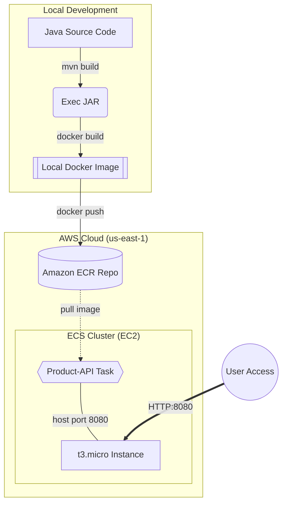

# Deploying Product API to AWS ECR and ECS (Free Tier)

This plan details the steps to build, push, and deploy the `product-api` container to AWS ECS while strictly adhering to the AWS Free Tier limitations to ensure you incur no charges. We are using an EC2 `t2.micro` instance instead of Fargate.

## Deployment Flow Diagram



## Proposed Changes & Commands

### 1. Docker and AWS ECR
**Commands:**
```bash
# Build and Tag Docker image (Multi-stage build handles JAR creation)
docker build -t product-api .

# Authenticate with Amazon ECR
aws ecr get-login-password --region us-east-1 | docker login --username AWS --password-stdin 606349122774.dkr.ecr.us-east-1.amazonaws.com

# Tag and Push to ECR
docker tag product-api:latest 606349122774.dkr.ecr.us-east-1.amazonaws.com/product-api:latest
docker push 606349122774.dkr.ecr.us-east-1.amazonaws.com/product-api:latest
```

### 2. Redeploying Updates
To apply code changes (like adding sample products):
```bash
# Force a new deployment to pull the latest image
aws ecs update-service --cluster product-api-cluster --service product-api-service --force-new-deployment
```

### 2. AWS ECS Free Tier Infrastructure (EC2)
**Commands:**
```bash
# Create ECS Cluster
aws ecs create-cluster --cluster-name product-api-cluster

# IAM Role Setup
aws iam create-role --role-name ecsInstanceRole --assume-role-policy-document file://ecs-trust-policy.json
aws iam attach-role-policy --role-name ecsInstanceRole --policy-arn arn:aws:iam::aws:policy/service-role/AmazonEC2ContainerServiceforEC2Role
aws iam create-instance-profile --instance-profile-name ecsInstanceRole
aws iam add-role-to-instance-profile --instance-profile-name ecsInstanceRole --role-name ecsInstanceRole

# Security Group
aws ec2 create-security-group --group-name ecs-sg --description "ECS Security Group" --vpc-id <vpc-id>
aws ec2 authorize-security-group-ingress --group-id <sg-id> --protocol tcp --port 8080 --cidr 0.0.0.0/0

# Launch EC2 Instance (t2.micro)
aws ec2 run-instances --image-id <ecs-optimized-ami> --count 1 --instance-type t2.micro --iam-instance-profile Name=ecsInstanceRole --security-group-ids <sg-id> --user-data file://user-data.txt
```

### 3. Task Definition and Service
**Commands:**
```bash
# Register the updated task definition (EC2 mode)
aws ecs register-task-definition --cli-input-json file://task-defination.json

# Create ECS Service to run 1 task
aws ecs create-service --cluster product-api-cluster --service-name product-api-service --task-definition product-api-task --desired-count 1 --launch-type EC2
```

## Verification Plan
1. Check tasks are running: `aws ecs list-tasks --cluster product-api-cluster`
2. Fetch EC2 public IP: `aws ec2 describe-instances --filters Name=instance-state-name,Values=running`
3. Access API: `http://<EC2_PUBLIC_IP>:8080/products`
